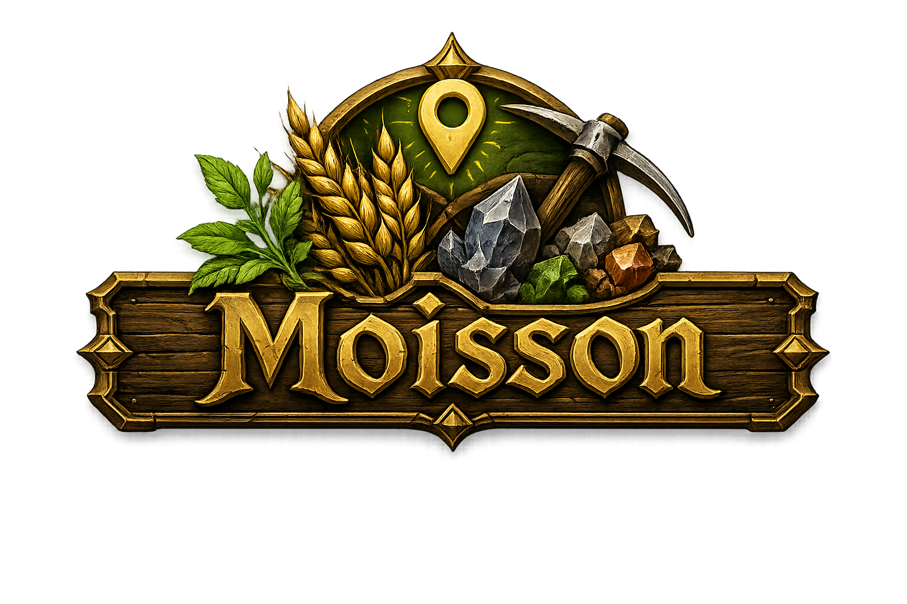

<p align="center"></p>

HUD de récolte plein écran pour WoW Classic Era, avec compteurs de farm.

Le mécanisme du HUD est un hommage à [FarmHud](https://www.curseforge.com/wow/addons/farmhud)
de Hizuro (GPL) : même principe — la vraie minimap est déplacée en plein écran,
zoom minimum, fond quasi transparent — mais le code est une réécriture complète,
taillée pour une config ElvUI + GatherMate2 + Questie, et enrichie de compteurs
de récolte qui n'existent pas dans l'original.

## Fonctions

- **HUD plein écran** : la minimap s'étire sur tout l'écran, les pins
  GatherMate2/Questie restent opaques pendant que le fond de carte s'efface.
- **Rotation radar** (optionnelle) : la carte tourne avec le joueur,
  points cardinaux N/NE/E/SE/S/SO/O/NO recalculés en continu.
- **Compteurs de récolte** : herbes, minerais, gemmes, cuirs, tissus, viandes,
  élémentaires — par objet avec icône, récolte de la **session** et quantité
  **en sac** (stocks antérieurs compris). Totaux globaux persistants par
  catégorie via `/moisson bilan` en chat.
- **Besace** : ce que les sacs contiennent pour le(s) métier(s) de récolte du
  personnage (herboristerie → herbes, minage → minerais et gemmes,
  dépeçage → cuirs).
- **Mode radar** : le fond de carte cycle entre invisible, radar (alpha
  modéré + voile noir : les détections « Trouver les herbes/minerais »
  restent visibles sur terrain éteint) et carte.
- **Coordonnées** du joueur, masquage en combat (optionnel). Tout se pilote
  depuis le bouton minimap : clic gauche = HUD, clic droit = options,
  maj-clic = fond, clic molette = souris.
- Un « leurre » occupe l'ancien emplacement de la minimap : les boutons
  d'addons (ElvUI, MinimapButtonButton, LibDBIcon…) restent à leur place.

## Commandes

```
/moisson              affiche / masque le HUD
/moisson souris       active la souris (tooltips des pins)
/moisson rotation     carte fixe ou rotative
/moisson taille 0.9   fraction de l'écran (0.3 à 1)
/moisson alpha 0.25   transparence du fond (0 à 1)
/moisson compteurs    panneau de récolte on/off
/moisson bilan        totaux par catégorie en chat
/moisson raz [tout]   remise à zéro session (ou tout)
```

Des raccourcis clavier sont disponibles dans Options → Raccourcis → Moisson.

## Installation

```sh
./install.sh   # rsync vers le dossier AddOns de Classic Era
```

## Langues

enUS (défaut) et frFR — voir `Moisson/locales.lua`. Les commandes slash
existent dans les deux langues (`/moisson souris` = `/moisson mouse`).

## Licence

GPLv3 — voir [LICENSE](LICENSE).

## Crédits

- Hizuro — FarmHud, l'original, pour l'idée et des années de bons services.
- yokoul — réécriture et compteurs.
